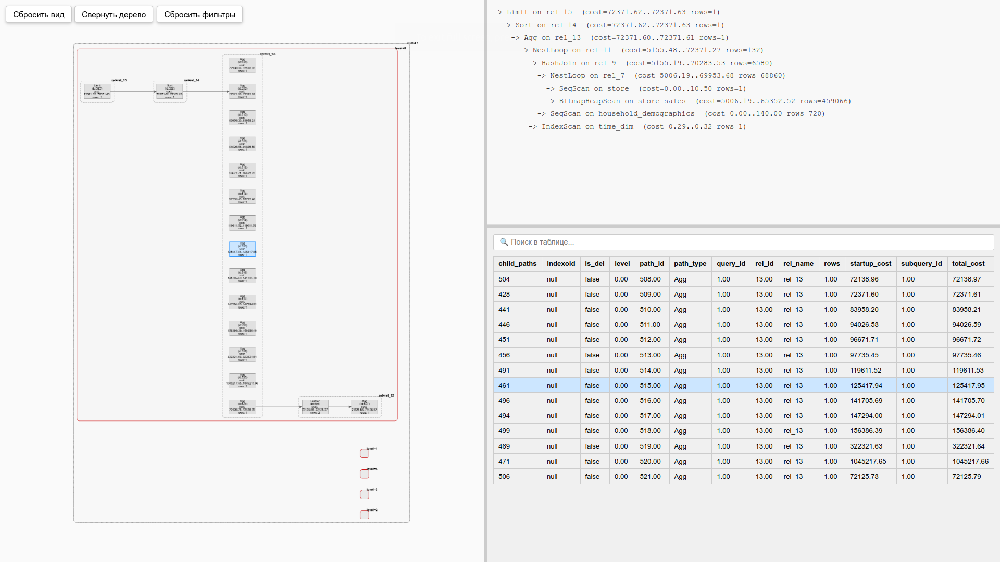

ee_visualizer -- утилита для визуализации данных, полученных с помощью расширения СУБД PostgreSQL [extended_explain](https://github.com/04ina/extended_explain). Визуализирует в удобном виде все пути (узлы), которые оптимизатор/планировщик перебирал в процессе поиска наилучшего плана исполнения запроса. 



Содержание:

1. [Как запустить](#как-запустить)
2. [Как использовать](#как-использовать)
    1. [Интерактивное дерево путей](#интерактивное-дерево-путей)
    2. [Лучший план](#лучший-план)
    3. [Таблица альтернативных путей](#таблица-альтернативных-путей)
    4. [Остальное](#остальное)

# Как запустить

Копируем репозиторий

```sh
git clone https://github.com/04ina/extended_explain.git
```

Делаем дамп нужного запроса из таблицы ee.paths

```sql
COPY ee.paths TO '/directory/paths.csv'
```

Если в таблице ee.paths несколько запросов, то делаем дамп путей с указанием соответствующего query_id

```sql
COPY (SELECT * FROM ee.paths WHERE query_id = 1) TO '/directory/paths.csv'
```

Конвертируем полученный csv дамп в файл data.json с помощью скрипта csv_to_json.py

```sh
python3 csv_to_json.py /directory/tpcds1.csv > data.json
```

Запускаем локальный сервер на порте 8000. Файл data.json должен быть в одной директории с index.html

```sh
python3 -m http.server 8000
```

Далее в браузере запускаем утилиту по адресу http://localhost:8000

# Как использовать 

Визуализация представлена в виде трех окон:

## Интерактивное дерево путей

Находится в левой части экрана. Состоит из подзапросов, уровней, отношений (base rel (level = 1), join rel, upper rel (level = 0)) и путей. По умолчанию в данном окне развернут лучший план выполнения запроса, но при необходимости можно развернуть иои свернуть тот или иной объект. Все связанные пути соединены ребрами. Если нажать на путь, то желтым цветом подсветятся все низлежащие дочерние пути. Если при зажатом CTRL нажать ЛКМ по абстрактному отношению, то появится окно фильтрации путей по названию. Сбросить фильтрацию можно либо очищением фильтра в сплывающем окне, либо посредством кнопки "сбросить фильтры" в левой верхней части экрана.

Отношения содержат группы лучших и остальных путей. Лучшие пути содержатся в лучшем плане запроса, а остальные -- это пути, которых нет в лучшем плане. Это сделано для того, чтобы можно было развернуть лишь лучшие пути, не разворачивая остальные, что улучшает читабельность графа. По тем же соображениям есть и группа лучших и остальных отношений для конкретного уровня. Лучшее отношение содержит в себе лучший путь. Стоит отметить, что данная механика не нужна для подзапросов и уровней, поскольку в них не может не быть лучшего отношения, а значит и лучшего пути.

Если два раза нажать левой кнопкой мыши по узлу дерева, то камера приблизится к нему.

Помимо этого есть и другие кнопки:
1. Сбросить вид -- возвращает камеру в исходное положение.
2. Свернуть дерево -- Сворачивает все объекты дерева
3. Развернуть лучший план -- разворачивает лучший план.
4. Повернуть layout -- переключает режимы вывода узлов графа. Поддерживается два режима: горизонтальный и вертикальный.

## Лучший план

Лучший план, который был выбран планировщиком. Расположен в правой верхней части экрана. Имеет схожую с EXPLAIN структуру. При нажатии на узел подсвечивается соответствующий путь или объект дерева, где находится данный путь; таким образом можно найти нужный путь в дереве, даже если дерево не полностью развернуто. Если два раза нажать левой кнопкой мыши на узел лучшего плана, то камера дерева путей укажет соответствующий путь или объек, где сокрыт путь.

Также при выборе узла лучшего плана в таблице альтернативных путей выводятся все альтернативные пути (Непосредственно выбранный узел подсвечивается синим в таблице).

## Таблица альтернативных путей

Расположена в правой нижней части экрана. Выводит в виде таблицы формата ee.paths все пути, являющиеся альтернативными по отношению к выбранному пути. Таблица имеет поиск, а также сортировку по столбцам. Для сортировки по возрастанию/убыванию необходимо нажать на название соответствующей колонки. При нажатии на запись таблицы в дереве путей будет отмечен объект, в котором находится данный путь (или сам путь, если нужные вышестоящие объекты уже раскрыты).

При необходимости с помощью меню "Столбцы" можно сокрыть столбец или группу столбцов.

## Остальное 

При необходимости размеры каждого окна можно изменить.

Чтобы протестировать функционал утилиты, поместите файл репозитория example/data.json в одну директорию с файлом index.html (корневая директория репозитория). 

